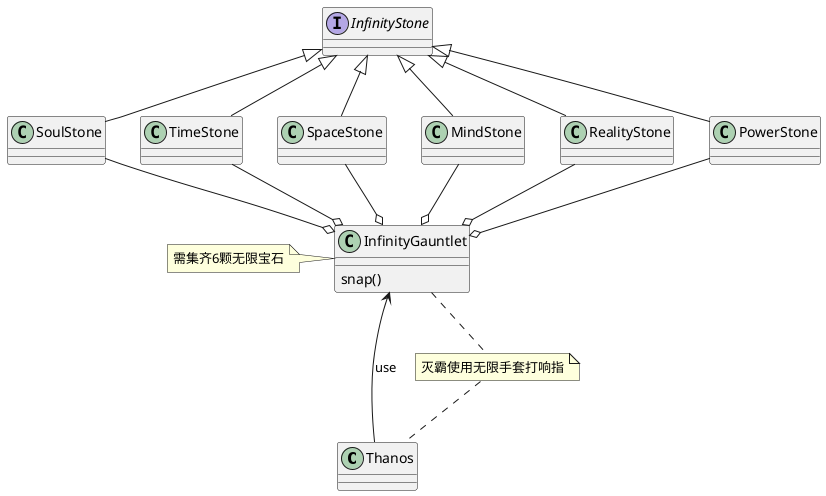

```plantuml
@startuml
Thanos -up-> InfinityGauntlet : use

SoulStone -up-|> InfinityStone
TimeStone -up-|> InfinityStone
SpaceStone -up-|> InfinityStone
MindStone -up-|> InfinityStone
RealityStone -up-|> InfinityStone
PowerStone -up-|> InfinityStone

SoulStone --o InfinityGauntlet
TimeStone --o InfinityGauntlet
SpaceStone --o InfinityGauntlet
MindStone --o InfinityGauntlet
RealityStone --o InfinityGauntlet
PowerStone --o InfinityGauntlet

interface InfinityStone {}

class InfinityGauntlet {
  snap()
}

note left:  需集齐6颗无限宝石

note "灭霸使用无限手套打响指" as N

N .. Thanos
InfinityGauntlet .. N
@enduml
```
