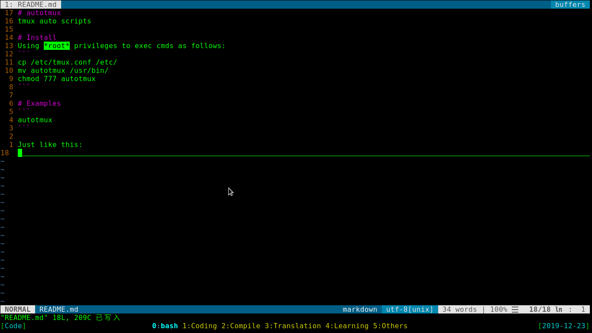

# autotmux
tmux auto scripts

# Install
Using *root* privileges to exec cmds as follows:
```
cp /etc/tmux.conf /etc/
mv autotmux /usr/bin/
chmod 777 autotmux
```

# Examples
```
autotmux
```
Just like this:

